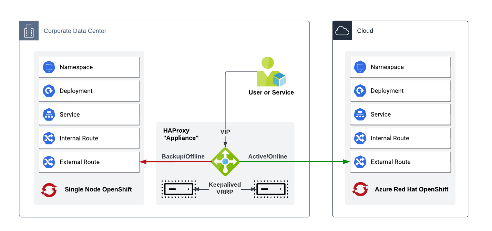

# Ansible HA HAProxy

This repo will configure a set of RHEL servers to act as simple HAProxy Load Balancers that share a VIP and float that VIP with keepalived in a fail-over pattern that sticks to the secondary server until manually reset.

## Architecture

Essentially, this will provide a virtual load balancer appliance of sorts that operates with:

- **Two RHEL VMs running HAProxy** and Keepalived
- **Keepalived** maintaining a **floating VIP** between the two VMs
- **Clients** make requests to the Load Balancer via the VIP, as long as the cloud target is online it will send traffic there - if the cloud target is offline it will fail back to the local target.
- The **cloud target** is an application running in an Azure Red Hat OpenShift cluster, the **local target** is the same application running on a Single Node OpenShift instance.  The targets could be anything, running anywhere.



## Prerequisites

- **RHEL 9 Installation Media** - Download it from https://access.redhat.com/
- **Three IPs** - Covering both VMs, and the floating VIP.
- **DNS Records** - Make sure the VMs have hostnames in A records and their relative PTR records - an A record pointing to the VIP is also needed, this will be used as a common Route shared between both targets.
- **Active/Cloud/Online Target** - In this example, the Active/Online target is the ARO cluster's Application Ingress Load Balancer.
- **Failback/Local/Offline Target** - In this example, the Failback/Offline target is IP of the SNO instance.
- **SSL Certificates** - SSL/TLS will be terminated at the HAProxy instances since they operate in HTTP/L7 mode so you'll need a certificate to install on both of the VMs.

In my lab, my resources look like this:

| Entity         | IP            | DNS A Records               |
|----------------|---------------|-----------------------------|
| RHEL VM #1     | 192.168.42.35 | lb-1.kemo.labs              |
| RHEL VM #2     | 192.168.42.36 | lb-2.kemo.labs              |
| HAProxy VIP    | 192.168.42.37 | *.mco-apps.kemo.labs        |
| Cloud Target   | 192.168.70.81 | N/A                         |
| Local Target   | 192.168.42.34 | N/A                         |
| SSL Cert       | 192.168.42.37 | (CN) *.mco-apps.kemo.labs   |

You can deploy this to any platform, you just need to create the RHEL VMs first.  If you're deploying this to a Libvirt host, there is an example Ansible Playbook that can automate the creation of the KVM instances.

---

## Pre-execution Configuration

Once you have a set of RHEL VMs to use as Load Balancer nodes, you just need to set up some authentication, an `inventory` file, some variables, and to and run the Playbook.

> If you're using the extra Libvirt/KVM playbook, the SSH Keys and inventory are made for you

### SSH Keys

In order to access the servers, you'll need to provide it some SSH Keys to authenticate with.

If you don't already have an SSH Keypair, create one:

```bash
# Create an SSH Key Pair
## RSA type (-t rsa)
## 4096 bit length (-b 4096)
## As a specific file (-f ~/.ssh/lb-id_rsa)
## With no password (-N '')
ssh-keygen -t rsa -b 4096 -f ~/.ssh/lb-id_rsa -N ''

# Copy the SSH Key to the remote hosts' root user
ssh-copy-id -i ~/.ssh/lb-id_rsa root@lb-1
ssh-copy-id -i ~/.ssh/lb-id_rsa root@lb-2
```

### Ansible Inventory

Configure your `inventory` file similarly:

```ini
[loadbalancers]
lb-1 ansible_host=192.168.42.35 keepalived_role=master
lb-2 ansible_host=192.168.42.36 keepalived_role=slave

[loadbalancers:vars]
ansible_ssh_user=root
ansible_ssh_private_key_file=~/.ssh/lb-id_rsa
ansible_ssh_common_args='-o UserKnownHostsFile=/dev/null -o StrictHostKeyChecking=no'
```

Make sure to swap out the hostname and IPs, and set any alternative username that you're connecting as.

### Generating an SSL Certificate

In case you don't have an SSL certificate from some CA, you can run the following commands below to generate a self-signed certificate for testing purposes:

```bash
# Set the base domaain
BASE_DOMAIN="mco-apps.kemo.labs"

# Generate a Key
openssl genrsa -out server.key 2048

# Create a Certificate Signing Request
openssl req -new -key server.key -out server.csr -subj "/C=US/ST=California/L=Los Angeles/O=IT/CN=*.${BASE_DOMAIN}"

# Self-sign the certificate
openssl x509 -req -days 365 -in server.csr -signkey server.key -out server.cert

# Concatenate the key and certificate into a bundle for HAProxy to use
cat server.key server.cert > haproxy-bundle.pem
```

### Runtime Variables

You'll need to set a few variables to match your target environment - they can be defined in an external variable file such as `deploy.vars.yml`:

```yaml
primary_server_endpoint: "192.168.70.81" # The primary/cloud/online target
backup_server_endpoint: "192.168.42.34" # The backup/local/offline target
keepalived_shared_ip: "192.168.42.37" # THe HAProxy VIP

cert_bundle_path: haproxy-bundle.pem # Path to a PEM formatted Key+Certificate bundle for HAProxy SSL endpoints
```

There are additional variables defined in the `deploy.yml` Playbook that can be overridden but this should be all that's required in order to operate.

---

## Running the Playbook

With the SSH authentication, inventory, SSL certificate bundle, and variables set, we can now run the playbook which will:

- Connect to the RHEL VMs
- Install the needed packages
- Enable the Cockpit dashboard
- Configure the HAProxy and Keepalived services
- Copy over the SSL certificate bundle
- Start and enable the services to start at boot

```bash
# Run the automation
ansible-playbook \
 -i inventory \
 -e "@deploy.vars.yml" \
 deploy.yml
```

After the completion of that Playbook, you can access the Cockpit dashboards at hostname:9090, eg `https://lb-1.kemo.labs:9090/` - pretty handy.

---

## Accessing Statistics

By default, the HAProxy instances will expose a stats endpoint that can be accessed via your web browser - the endpoint by default is served on the load balancer VMs themselves, via HTTP at port `1936`, with a path of `/haproxy?stats`, eg `http://lb-1.kemo.labs:1936/haproxy?stats` and `http://lb-2.kemo.labs:1936/haproxy?stats`

In order to serve them via HTTPS then just create a certificate for it and provide it to the `listen` stanza in the HAProxy configuration.

---

## HAProxy Administrative Socket

By default, the HAProxy instances will expose an administrative socket that can only be accessed via the local systems.

Read more about using the HAProxy Administrative Socket here: https://kenmoini.com/post/2023/04/haproxy-stats-and-sockets/#using-the-administrative-socket

---

## Extras - Offlining Backend Servers & Clearing Stick Tables

In this architecture, the traffic flows to the online target when all systems are green.

When connectivity to the cloud from the on-premise datacenter is interupted then the load balancers will fail back to the local target and keep the traffic there until directed to do so otherwise.  This is done via [Stick Tables](https://www.haproxy.com/blog/introduction-to-haproxy-stick-tables/).

We can simulate the failover pattern flow by leveraging the administrative socket on load balancer endpoints.  The commands need to be run on all VMs within quick succession.

```bash
# The following sets up some functions
# that run the commands via SSH for quickly sending it to both servers
function disableCloudServer {
  ssh -i ~/.ssh/lb-id_rsa \
  -o UserKnownHostsFile=/dev/null -o StrictHostKeyChecking=no \
  ${1} \
  'echo "disable server https/cloudserver" | sudo socat stdio /run/haproxy/admin.sock'
}
function enableCloudServer {
  ssh -i ~/.ssh/lb-id_rsa \
  -o UserKnownHostsFile=/dev/null -o StrictHostKeyChecking=no \
  ${1} \
  'echo "enable server https/cloudserver" | sudo socat stdio /run/haproxy/admin.sock'
}
function clearStickTable {
  ssh -i ~/.ssh/lb-id_rsa \
  -o UserKnownHostsFile=/dev/null -o StrictHostKeyChecking=no \
  ${1} \
  'echo "clear table https" | sudo socat stdio /run/haproxy/admin.sock'
}

# Run the named functions with the target user@server as the parameter

# Disable the cloud server target - there will not be much of any output
disableCloudServer root@lb-1.kemo.labs && disableCloudServer root@lb-2.kemo.labs

# Enable the cloud server target - notice how traffic still hasn't returned to it
enableCloudServer root@lb-1.kemo.labs && enableCloudServer root@lb-2.kemo.labs

# To flow traffic back to the cloud server target, we must clear the stick table
clearStickTable root@lb-1.kemo.labs && clearStickTable root@lb-2.kemo.labs
```

---

## Extras - Creating the test Libvirt/KVM VMs

In case you're deploying this to a Libvirt/KVM hypervisor host, you can find some extra bits to automate that too.  The prerequisites are still needed, and they need to be supplied to the `extra-libvirt-vm.yml` Playbook:

```yaml
# General operations
lb_base_domain: mco-apps.kemo.labs # The base domain for the loadbalancer, will be prefixed with *. for the SSL cert
lb_vip: 192.168.42.37 # The VIP for the loadbalancer

create_ssl_keys: true # Create the SSL keys for the loadbalancer, or provide them

# Libvirt things
install_iso_path: /mnt/ISOs/rhel9.1-x86_64.iso # The path to the RHEL 9 install ISO
libvirt_bridge: bridge0 # The libvirt bridge to use
disk_size: 30 # The size of the disk in GB

root_user_password: securePassword # The root user password for the VMs

chown_user: kemo # The local ansible controller user to chown the files to
chown_group: kemo # The local ansible controller group to chown the files to

# Make sure to change the networking to match your environment!
node_base_domain: kemo.labs # The base domain for the loadbalancer VMs' hostnames

# Define the VMs
nodes:
  - name: lb-1
    mode: primary
    vm:
      cpu_cores: 2
      cpu_sockets: 1
      cpu_threads: 1
      memory: 4096
    networking: # Make sure to change the networking to match your environment!
      ip: 192.168.42.35
      mask: 255.255.255.0
      gateway: 192.168.42.1
      dns:
        - 192.168.42.9
        - 192.168.42.10

  - name: lb-2
    mode: backup
    vm:
      cpu_cores: 2
      cpu_sockets: 1
      cpu_threads: 1
      memory: 4096
    networking: # Make sure to change the networking to match your environment!
      ip: 192.168.42.36
      mask: 255.255.255.0
      gateway: 192.168.42.1
      dns:
        - 192.168.42.9
        - 192.168.42.10
```

You can save your edited variables to something like `kvm-vars.yml` and then run the Playbook:

```bash
# Create the Libvirt VMs
ansible-playbook -e mode=create -e "@kvm-vars.yml" extra-libvirt-vm.yml

# or

# Destroy the Libvirt VMs
ansible-playbook -e mode=destroy -e "@kvm-vars.yml" extra-libvirt-vm.yml
```

Once the VMs are created they'll boot up, install, and then shut down.  Start them back up and then you can continue the rest of the configuration with:

```bash
# Run the Playbook with the generated assets
ansible-playbook -i .generated/gen_inventory -e "@deploy.vars.yml" deploy.yml
```

---

## Extras - OpenShift Deployments

In case you want to fully recreate this architecture as a demo, you can find some additional YAML files in the `extra/ocp-test/` directory.

The files in this directory deploy two example applications.  One is a .NET application that has a bit of interactivity, and the other is a very simple HTTPD server with a very simple blue/red variation in color.

You'll need to apply the manifests slightly differently to each cluster:

```bash
# Edit the extra/ocp-test/10-shared-routes.yml file as needed
# Change the `.spec.host` to point to something that resolves to the VIP

# Log into the Active/Cloud/Online OpenShift cluster
oc login ...

# Apply the Active/Cloud/Online cluster manifests
oc apply -f extra/ocp-test/common-manifests/ && oc apply -f extra/ocp-test/00-configmap-cloudserver.yml

# Log into the Backup/Local/Offline OpenShift cluster
oc login ...

# Apply the Backup/Local/Offline cluster manifests
oc apply -f extra/ocp-test/common-manifests/ && oc apply -f extra/ocp-test/00-configmap-localserver.yml
```

You should now be able to access the routes on each cluster and see the individual deployments and atomic routes, as well as the shared routes.

Accessing the shared routes once the Load Balancers are configured should provide you with the applications, which you can then test against.